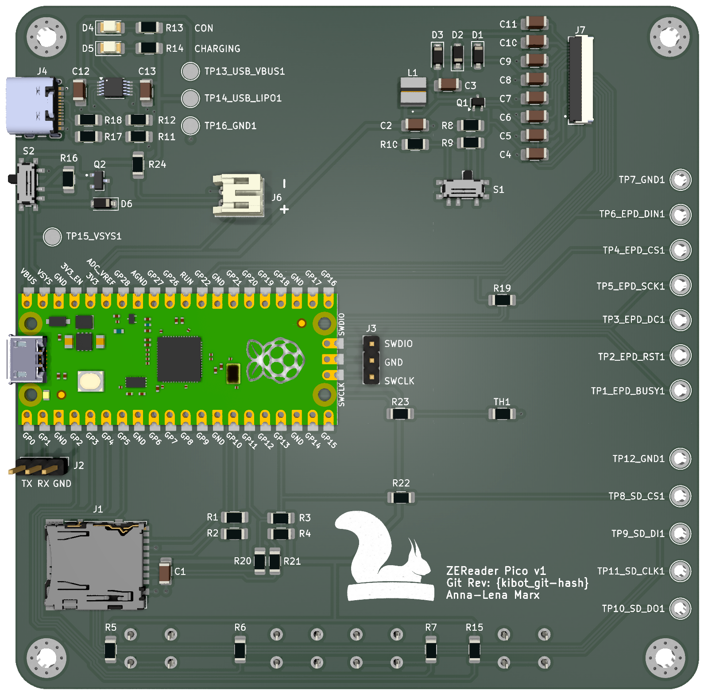

# ZEReader-PCB

Caution: v1 is working, but the FFC connector is inverted.
Twisting the cable solves the issue for now.
This is to be fixed in the next revision!

KiCad project for the ZEReader.
This project uses GitHub Actions and KiBot for CI/CD.

Outputs can be downloaded in the Actions section. They include:
- BoM (interactive for manual assembly and classical HTML)
- Drill file (.drl)
- Gerber files (.gbr)
- KiRi KiCad Revision Inspector files and server
  To make use of KiRi, move everything besides 'kiri-server' in a subdirectory called 'web'
  and start the server using 'python kiri-server .' from the KiRi directory
- PCB Renderings
- PDF Schematic/PCB printout from KiCad
- ERC Output (HTML)
- DRC Output (HTML)
- Fabrication Ready Zip

All CI generated output files like schematic and pcb should contain the git revision hash
of the commit they were generated from to clearly identify the exact design version.
The git revision hash is also added as a silk screen label to the manufacturing files.

This intended to help with a more agile approach in hardware development.
Besides, KiRi makes it easy to visualize and understand changes in schematic and pcb files tracked by git.

## Production
[AISLER]([https://aisler.net/](https://aisler.net/en?utm_source=zereader) helps to make this project alive.

To get the lastest revision manufactured, just follow this link for [Uploading to AISLER](https://aisler.net/p/new?url=https://raw.githubusercontent.com/Allegra42/ZEReader-KiCad/refs/heads/main/ZEReader-Pico.kicad_pcb&ref=github).

Alternatively, the GitHub Actions output already contains a prepacked ZIP file with everything needed for production and correct git revisions filled in.

## License
While the project is license as CERN-OHL-S v2, the squirrel logo is a registered design and not allowed to be used in other contexts.
